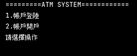
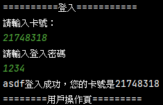
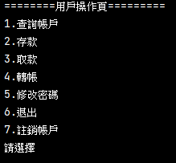

# 說明文件
## 說明：
* ATMSystem是一個基於命令列的模擬銀行ATM操作練習作品
* 練習內容包含流程控制及ArrayList操作
  
## 功能展開：!
 ### 帳戶登錄(系統如無帳戶資料則提醒需先開戶)

   * 輸入卡號登錄(輸入錯誤則再次輸入)
   * 輸入登入密碼(輸入錯誤則再次輸入)

     

   
  * 功能項
    * 查詢帳戶(顯示卡號、姓名、餘額及操作限額)
    * 存款(帳戶金額增加，存入後顯示帳戶資訊)
    * 取款(帳戶金額減少，存入後顯示帳戶資訊，如超過提款限額則會提醒並禁止操作)
    * 轉帳(需輸入對方卡號及姓氏防呆後方能輸入轉帳金額)
    * 修改密碼(密碼再次確認防輸入錯誤，修改完成後退出重登)
    * 退出
    * 註銷帳戶(刪除前警告再確認，如帳戶尚有餘額則無法刪除)
    * 
 ### 帳戶開戶
   * 須設定使用者名稱、密碼
   * 密碼再次確認防輸入錯誤
   * 設定每次操作金額限制
   * 開戶完成後隨機產生卡號
   * 
 
